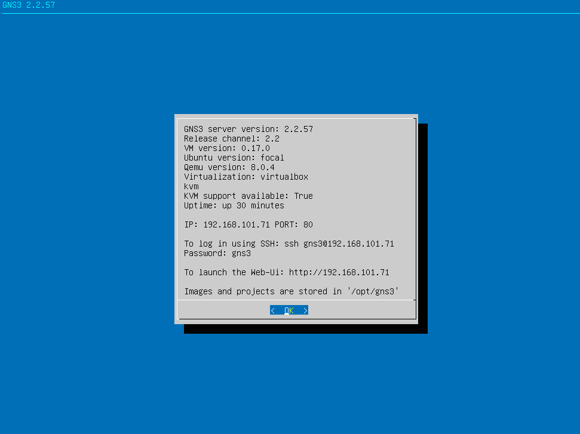
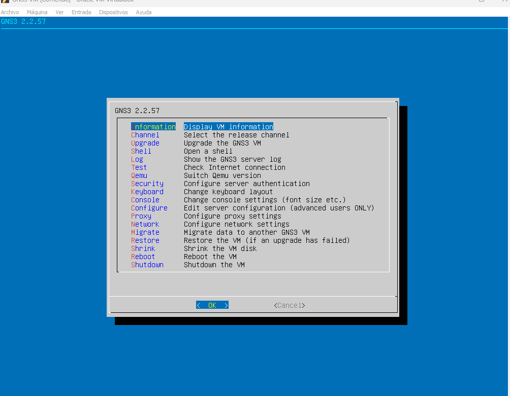

  

# Implementación Avanzada de GNS3 sobre Entornos Híbridos (Windows 11, VirtualBox y ESXi)

Este repositorio contiene la investigación técnica detallada sobre la integración de hipervisores de Tipo 1 y Tipo 2 para la emulación de redes de alta fidelidad.

## 1. Arquitectura de Virtualización en Windows 11
La implementación en Windows 11 presenta desafíos únicos debido a las capas de seguridad integradas:

* **VBS (Virtualization-Based Security)**: El aislamiento de núcleo utiliza Hyper-V de forma silenciosa, lo que puede generar conflictos con otros hipervisores de Tipo 2. Se configuró el sistema para permitir la coexistencia de recursos.
* **Activación de VT-x/AMD-V**: Se habilitaron las extensiones de virtualización en la BIOS/UEFI, permitiendo que el procesador gestione las instrucciones de las máquinas virtuales en el **Anillo 0**, reduciendo drásticamente la latencia.

## 2. GNS3 VM: El Motor de Aceleración KVM
Para un rendimiento profesional, no basta con ejecutar GNS3 de forma local; es imperativo el uso de la **GNS3 VM**.

* **KVM (Kernel-based Virtual Machine)**: Se logró activar el soporte KVM (**KVM support: True**). Esto permite que las máquinas virtuales (como routers Cisco o Firewalls Fortinet) corran de forma casi nativa sobre el kernel de Linux de la VM, evitando la emulación por software que consume demasiada CPU.

## 3. Integración de Hipervisores (Tipo 1 vs Tipo 2)

### VirtualBox (Tipo 2 - Local)
Utilizado para entornos de desarrollo rápido. Se configuró:
* **Adaptador Host-Only**: Para crear una red privada entre el GUI de GNS3 y la VM.
* **Modo Promiscuo**: Configurado en "Permitir todo". Técnicamente, esto es vital para que la interfaz de red capture y procese tramas que no van dirigidas a su propia dirección MAC, permitiendo el switching de Capa 2.

### VMware ESXi (Tipo 1 - Remoto/Bare-Metal)
En un escenario de producción, GNS3 se conecta a un servidor ESXi.
* **Optimización**: Al correr directamente sobre el hardware (Bare-Metal), se elimina el "overhead" del sistema operativo anfitrión.
* **Políticas de Seguridad en vSwitch**: Se investigó la necesidad de aceptar "MAC address changes" y "Forged transmits" en los grupos de puertos de ESXi para permitir topologías de red complejas.

## 4. Matriz de Solución de Errores (Troubleshooting)

| Error Detectado | Análisis Técnico | Solución Implementada |
| :--- | :--- | :--- |
| **KVM: False** | El hipervisor no hereda las capacidades de virtualización de la CPU física (Virtualización Anidada). | `VBoxManage modifyvm "GNS3 VM" --nested-hw-virt on` o habilitar en ajustes de procesador. |
| **Port 3080 Blocked** | Conflicto de socket entre el cliente GNS3 y el servidor por bloqueo de Firewall. | Apertura de puertos TCP 3080 y rango dinámico (5000-10000) en el Firewall de Windows 11. |
| **uBridge Permissions** | El servicio uBridge requiere privilegios elevados para interceptar tráfico de red. | Ejecutar GNS3 con privilegios de administrador y configurar `setcap` en entornos Linux. |

## 5. Diagrama de Arquitectura del Sistema
El siguiente diagrama representa la jerarquía de las capas de software y hardware configuradas:

---
**Autor:** Alexis Smith Navarro Luque  
**Institución:** SENATI  
**Carrera:** Ingeniería de Ciberseguridad (5to Semestre)  
**Fecha:** 2026
