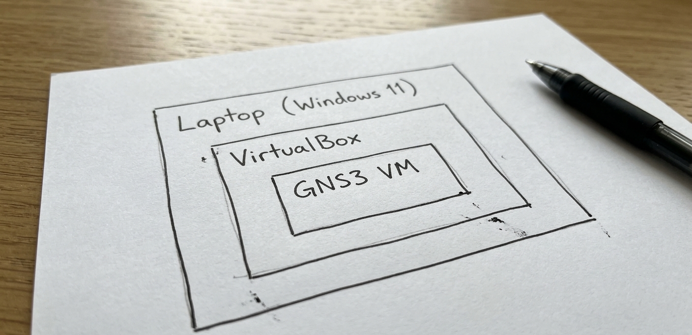

 
# Investigación: GNS3 e Hipervisores (Windows 11)

Este repositorio documenta la investigación y configuración de un entorno de emulación de redes profesional.

## 1. Configuración de Virtualización en Windows 11
Para ejecutar laboratorios de red, es obligatorio habilitar la **Virtualización** en la BIOS/UEFI de la placa base. 
* **Conflicto con Seguridad**: En Windows 11, el "Aislamiento de núcleo" puede bloquear el motor de virtualización de VirtualBox.
* **Rendimiento**: Se recomienda desactivar Hyper-V si se presentan errores de aceleración.

## 2. Implementación de GNS3 VM
La GNS3 VM es el servidor que ejecuta los nodos de red de manera eficiente.
* **Soporte KVM**: Como se muestra en la evidencia, el estado debe ser **True** para garantizar aceleración por hardware.

## 3. Configuración de Hipervisores (Tipo 1 y Tipo 2)
### VirtualBox (Tipo 2)
* **Adaptador Host-Only**: Se configura para permitir la comunicación entre el GUI de GNS3 y el servidor local.
* **Modo Promiscuo**: Es vital activarlo (Permitir todo) para que los paquetes de red fluyan entre los routers virtuales.

### VMware ESXi (Tipo 1)
* **Arquitectura**: A diferencia de VirtualBox, ESXi corre directamente sobre el hardware.
* **Conectividad**: Se requiere habilitar la seguridad en el vSwitch para permitir cambios de dirección MAC.

## 4. Matriz de Solución de Errores (Troubleshooting)

| Error Detectado | Causa Técnica | Solución Implementada |
| :--- | :--- | :--- |
| GNS3 VM: KVM support False | El hipervisor no pasa las extensiones de virtualización a la VM. | Habilitar "VT-x/AMD-V anidado" en la configuración de procesador de VirtualBox. |
| Error puerto 3080 | El Firewall de Windows bloquea la API de GNS3. | Crear regla de entrada en el Firewall para el ejecutable de GNS3. |
| Sin conectividad de red | Adaptador de red no está en modo promiscuo. | Cambiar configuración de red de la VM a "Permitir todo". |

## 5. Diagrama de Arquitectura
El siguiente esquema muestra la jerarquía de la instalación, donde la GNS3 VM corre de forma anidada dentro del hipervisor VirtualBox sobre el sistema anfitrión Windows 11.

---
*Investigación técnica para SENATI - Ingeniería de Ciberseguridad.*
